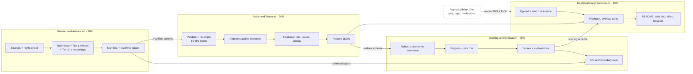
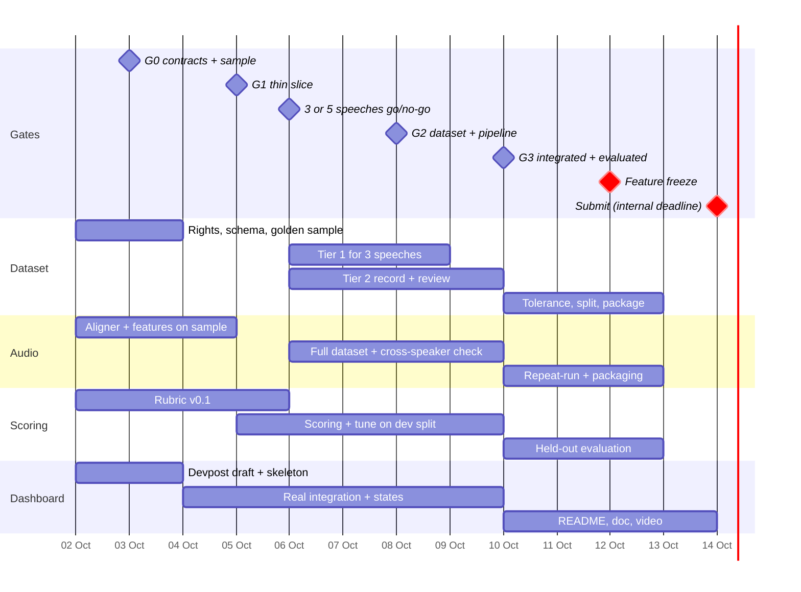
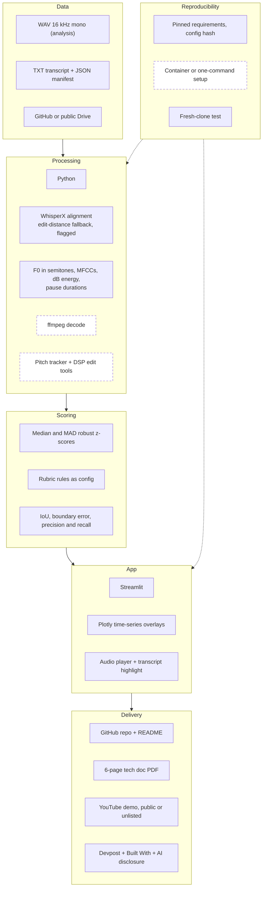
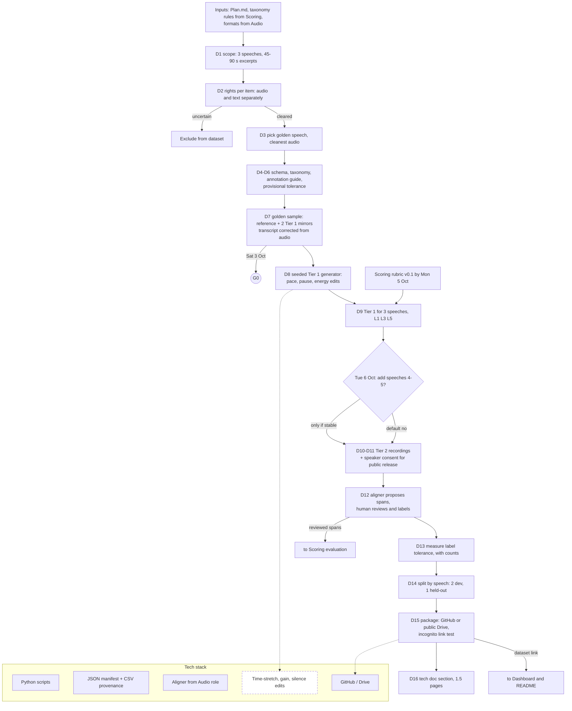
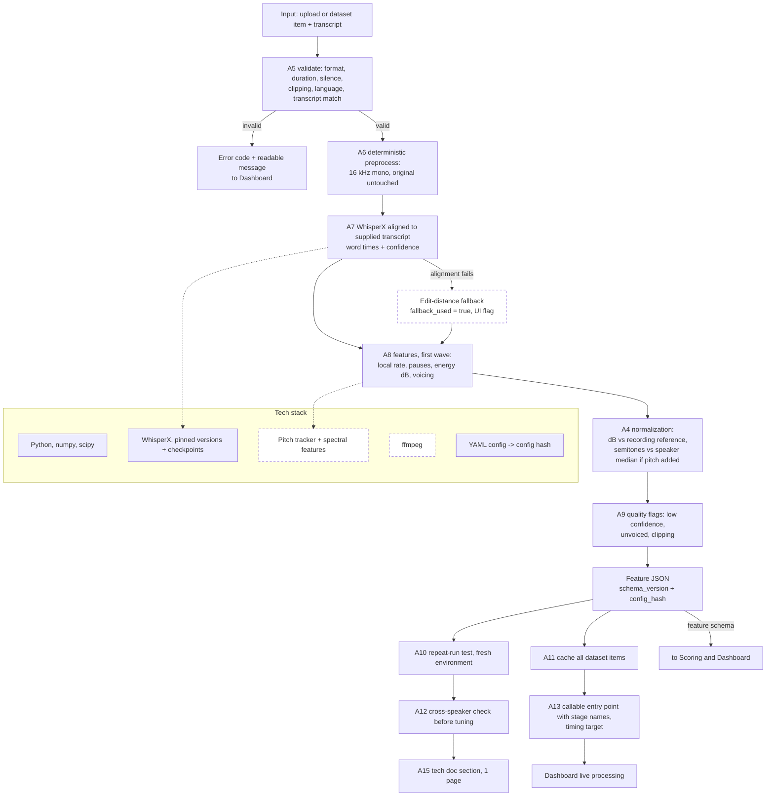
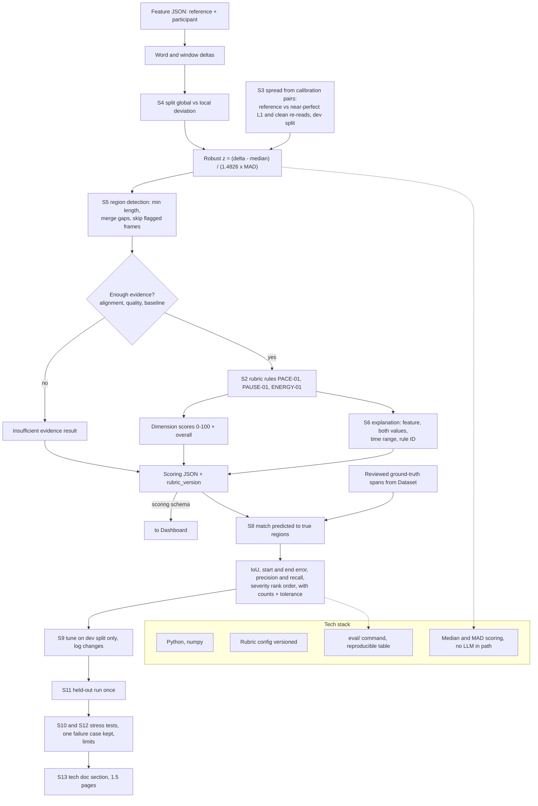
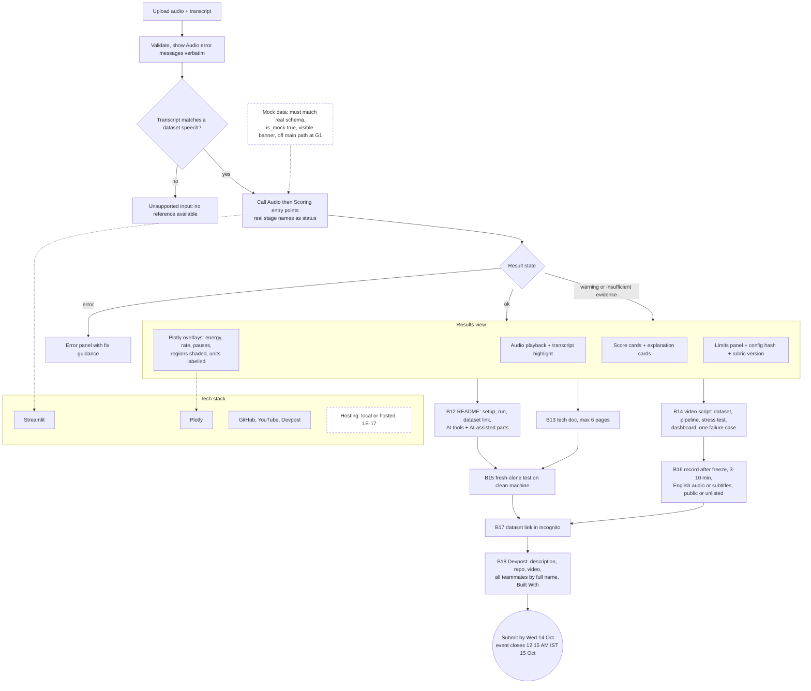

# Track C — Role Architecture and Workflow Diagrams

Built from `Plan.md`, `instructions.md` and process files `00`–`06`. Solid boxes are named in the deck or plan. Dashed boxes are proposals or undecided (tool or number still to be agreed). Step IDs (D, A, S, B) and loose-end IDs (LE) match the process files. GitHub renders these Mermaid blocks directly.

## 1. System overview and handoffs

## 2. Schedule by role (proposal aligned to the plan)

## 3. Tech stack map

## 4. Dataset and Annotation (30%)

## 5. Audio and Features (20%)

## 6. Scoring and Evaluation (25%)

## 7. Dashboard and Submission (15%)

