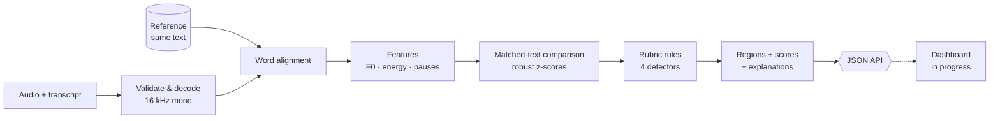

<div align="center">
#Arachne


**Replace subjective speech judging with reproducible, explainable measurements.**


[Quick start](#-quick-start) · [How it works](#-how-it-works) · [API](#-api) · [Rubric](#-rubric) · [Results](#-results) · [Limitations](#-limitations--honesty-notes) · [Roadmap](#-roadmap)

</div>

---

## Why Arachne?

Judging interpretive, persuasive and extemporaneous speech is subjective: scores vary between judges and feedback is vague.
Arachne treats a performance as a **time-series signal** and compares it with a reference reading of the **exact same text**.
Every finding names the *measured feature*, the *comparison*, the *time span* and the *rubric rule* that produced it.

> **What Arachne claims and doesn't.** A flagged region is a measurable difference from one chosen reference, tied to an explicit rule.
> It is **not** proof of a "wrong" delivery, of the speaker's intent, or of any cause.

<table>
<tr>
<td width="25%"><b>🎯 Temporal grounding</b><br/>Start/end timestamps for every deviation, mapped to words.</td>
<td width="25%"><b>🧮 Deterministic</b><br/>Robust z-scores and explicit rules. Same input + config = same output.</td>
<td width="25%"><b>🗣️ Speaker-agnostic</b><br/>Pitch in semitones re speaker median; energy median-centred.</td>
<td width="25%"><b>🔍 Traceable</b><br/>Config hash, rubric version and rule IDs in every result.</td>
</tr>
</table>

## 🧭 How it works



| Stage | Module | What it does |
|---|---|---|
| 1. Input | `audio_io.py` | Decodes/validates audio; clear error codes for unsupported, short, silent or mismatched input. |
| 2. Alignment | `align.py` | Default `proportional` backend: silence chunking → reference-prior DP word assignment → energy-valley Viterbi boundaries. Optional `whisperx` backend (see limitations). |
| 3. Features | `features.py` | Energy (dB), F0 via Praat autocorrelation, semitones re speaker median, per-word and pause features. |
| 4. Comparison | `compare.py` | Four deterministic detectors on matched words with MAD-based robust z-scores. |
| 5. Scoring | `scoring.py` | Per-dimension and overall score; returns **insufficient evidence** instead of guessing when SNR, voicing or alignment are inadequate. |

## 🚀 Quick start

```bash
# prerequisites: Python 3.12, ffmpeg; espeak-ng only to build the dev dataset
sudo apt-get install -y ffmpeg espeak-ng
pip install -r requirements.txt

make dataset     # builds ./dataset (63 items, ~70 MB, deterministic)
make test        # 9 tests: determinism, localisation, error handling, API
make evaluate    # writes results/evaluation.md
make stress      # writes results/stress.md
make serve       # API on http://127.0.0.1:8000
```

Analyze one recording from the command line:

```bash
python -m arachne analyze my_speech.wav \
  --transcript-file transcript.txt \
  --reference gettysburg \
  --out result.json
```

The reference id is a folder under `dataset/references/<id>/` containing `reference.wav` and `reference.json`.

## 🔌 API

| Method | Endpoint | Purpose |
|---|---|---|
| `GET` | `/health` | Engine version, schema version, config hash |
| `GET` | `/references` | Selectable references (id, title, transcript, provenance) |
| `GET` | `/rubric` | Rule definitions and standing limitations |
| `POST` | `/analyze` | Multipart: `audio`, `reference_id`, `transcript` → result JSON |

`POST /analyze` returns `200` with `status` = `ok` or `insufficient_evidence`; invalid input returns `422` with machine-readable `messages`.
Full field reference: [`docs/schema.md`](docs/schema.md).

<details>
<summary><b>Example region (format)</b></summary>

```jsonc
{
  "rule_id": "PAUSE-1",
  "dimension": "pauses",
  "direction": "long",
  "start_s": 20.81,
  "end_s": 22.66,
  "measured": { "part_pause_s": 1.87, "ref_pause_s": 0.06 },
  "delta": 1.81,
  "delta_unit": "s",
  "z": 18.1,
  "severity": 1.0,
  "severity_label": "strong",
  "explanation": "After word 31 ('...'): pause of 1.87s vs 0.06s in the reference (+1.81s longer). Rule PAUSE-1 (z=18.1)."
}
```
Values are illustrative of the format.
</details>

## 📏 Rubric

Every rule specifies feature, normalization, window, threshold and feedback template (`arachne/rubric.py`).

| Rule | Dimension | Feature | Fires when |
|---|---|---|---|
| `PACE-1` | Pacing | Articulation time per 3-word window (pauses excluded), relative to the utterance-wide pace ratio | robust z ≥ 2.5 and ≥ ~22% over ≥ 3 words |
| `PAUSE-1` | Pauses | Silent gap after word | ≥ 0.30 s longer than reference and z ≥ 2.5 |
| `PAUSE-2` | Pauses | Silent gap after word | reference pause ≥ 0.25 s and participant ≤ 40% of it |
| `PITCH-1` | Pitch contour | Local spread of word pitch (semitones, speaker-scaled) vs reference | z ≥ 2.5, ≥ ~1.8× change, over ≥ 4 words |
| `ENERGY-1` | Energy | Word energy (dB) relative to speaker median | z ≥ 2.5 and ≥ 4 dB over ≥ 3 words |

Overall score is a weighted mean of dimension scores (pacing 0.30, pauses 0.20, pitch 0.25, energy 0.25); the formula is returned with every result.

## 📊 Results

> **Read this first:** the current dataset is **synthetic** (espeak-ng speech, flaws injected programmatically). These numbers show pipeline behaviour on controlled single-factor flaws, **not** performance on human speech.

**Held-out speeches** (2 speeches, 42 items; thresholds were not tuned on them). Label tolerance: exact by construction.

| Dimension | Ground-truth spans | Recall @ IoU 0.3 | Recall @ IoU 0.5 | Mean IoU (matched) |
|---|---:|---:|---:|---:|
| Pacing | 14 | 0.86 | 0.86 | 0.92 |
| Pauses | 20 | 1.00 | 1.00 | 0.95 |
| Pitch contour | 8 | 0.88 | 0.88 | 0.66 |
| Energy | 6 | 1.00 | 0.83 | 0.89 |

- False-positive regions across the 42 held-out items: **4**; flagged regions on the 4 near-perfect mirrors: **0**.
- Severity ordering (dimension score falls as severity rises): **12 / 12** series.
- Pitch boundaries are loose (mean absolute boundary error ≈ 0.7 s); pacing and energy are tighter.

<details>
<summary><b>Stress test (1 speech, 21 items)</b></summary>

| Variant | Outcome |
|---|---|
| MP3 round-trip (48 kbps → 44.1 kHz) | Unchanged vs clean |
| 3 s added lead/trail silence | Unchanged vs clean |
| Noise 30 dB SNR | Pause recall 0.8, 5 false-positive regions |
| Noise 20 dB SNR | **Degrades**: 42 false-positive regions, pause recall 0.4 |
| Noise 10 dB SNR | **Degrades**: 27 false-positive regions; noise warning raised |

Treat noisy recordings as unsupported until the speech/pause detector and SNR estimate are improved. Details: `results/stress.md`.
</details>

## 🗂️ Dataset

Each speech has 21 items: 2 near-perfect mirrors (same / different speaker, with natural-variation jitter), 6 single-factor flaw families × 3 severities
(`pace_fast`, `pace_slow`, `pause_excess`, `pause_missing`, `pitch_flat`, `energy_quiet`), and 1 three-flaw combo.
Texts are short excerpts of public-domain US speeches (Gettysburg Address, Second Inaugural, FDR First Inaugural).
Each manifest row carries transcript, voice, flaw type/severity, ground-truth spans, format and provenance, labelled
`exact_by_construction; not human-reviewed`. See [`docs/dataset.md`](docs/dataset.md).

## 🧱 Project structure

```text
arachne/
├── arachne/          # audio_io · align · features · compare · rubric · scoring · pipeline · api · evaluate · stress · dataset
├── data/             # source speech texts
├── docs/             # schema.md · dataset.md
├── results/          # evaluation + stress outputs
├── tests/            # pytest suite
├── frontend/         # dashboard (in progress, built against the API)
├── Makefile
└── requirements.txt
```

## ⚠️ Limitations & honesty notes

- **Synthetic data only so far.** Real public-domain recordings, human re-recordings and human review of labels are still to be added; no label-accuracy claim is made.
- **Alignment is approximate.** The default aligner is a deterministic, model-free fallback. The WhisperX backend is implemented but untested here; re-run the evaluation after enabling it on real audio.
- **Noise sensitivity.** Results degrade at ≤ 20 dB SNR (see stress test).
- **Small, single-factor evaluation.** Thresholds were set a priori and adjusted once on one speech; real delivery is messier than injected flaws.
- **Measurements, not verdicts.** z-scores are robust standardisations within a recording pair, not universally calibrated judgments.

## 🛣️ Roadmap

- [x] Deterministic pipeline: alignment, features, four rubric detectors, scoring
- [x] Evidence-linked explanations with rule IDs
- [x] Synthetic contrastive dataset + evaluation + stress harness
- [x] REST API and result schema
- [ ] Dashboard (audio upload, playback, time-series overlays, explanation cards)
- [ ] Real public-domain baselines with verified reuse terms
- [ ] Human re-recordings and human-reviewed alignment/flaw labels
- [ ] WhisperX forced alignment validated on real audio
- [ ] Noise-robust speech/pause detection and SNR estimate
- [ ] Six-page technical document and demo video

## 🤖 AI assistance disclosure

Parts of this repository (pipeline code, tests and documentation) were written with assistance from **Claude (Anthropic)**.
This is also listed under *Built With* on the Devpost page.

## 👥 Team

| Name | Role |
|---|---|
| mohamedfadil12, Abdude69, Ammar, Rihan | Dataset & annotation · Audio & features · Scoring & evaluation · Dashboard & submission |

<div align="center">


</div>
